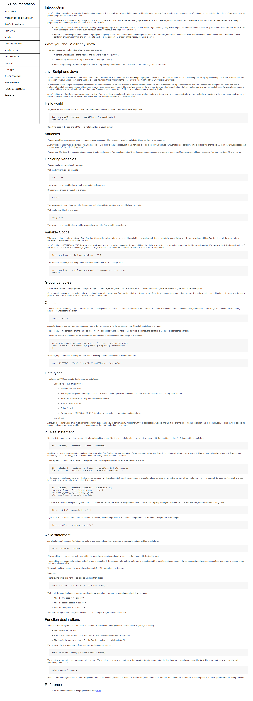

# Kolehiyolo | freeCodeCamp | Build a Technical Documentation Page
Welcome! I am a budding coder and this is my submission to the 'Build a Technical Documentation Page' project from freeCodeCamp.

## Table of contents
- [Overview](#overview)
  - [Summary](#summary)
  - [The Challenge](#the-challenge)
  - [Screenshots](#screenshots)
  - [Links](#links)
- [My Process](#my-process)
  - [Built With](#built-with)
  - [What I Learned](#what-i-learned)
  - [Continued Development](#continued-development)
  - [Useful Resources](#useful-resources)
- [Author](#author)
- [Acknowledgments](#acknowledgments)

## Overview
### Summary
The content of the project itself is epic in terms of it's value. So much valuable information about JavaScript is found here, although I already know most of it. Building the project itself, on the other hand, is challenging in terms of volume, as there's so much content and making it all work semantic-wise was quite taxing.

### The Challenge
- Perfectly mimic the sample page from [CodePen](https://codepen.io/freeCodeCamp/full/NdrKKL)
- Make sure to follow the user stories dictated by freeCodeCamp
- Build it while ensuring accessibility and responsive-ness

### Screenshots

  
  
  

### Links
TODO
- freeCodeCamp Challenge: [freeCodeCamp | Build a Technical Documentation Page](https://www.freecodecamp.org/learn/responsive-web-design/responsive-web-design-projects/build-a-technical-documentation-page)
- Sample: [CodePen](https://codepen.io/freeCodeCamp/full/NdrKKL)
- Solution URL: [GitHub Repo](https://github.com/kolehiyolo/freecodecamp--build_a_technical_documentation_page)
- Live Site URL (Static): [Kolehiyolo | freeCodeCamp | Build a Technical Documentation Page (Static)]()
- Live Site URL: [Kolehiyolo | freeCodeCamp | Build a Technical Documentation Page]()

## My process
### Built with
- HTML5
- CSS5
- SASS
- Mobile-first workflow

### What I learned
This project is great as I used it primarily as a typing exercise. It's also great in forcing me to think in terms of hierarchies. There's so much content and room for error but yeah I made it work. 

I thought about building the HTML with JavaScript builders with the data in variables but yeah I recognize that the challenge is supposed to be just HTML and CSS (although I chose to use SASS because cmon). Other than this, there isn't any truly challenging parts to this project.

### Continued development
Perhaps the best thing that I picked up on this project is being mindful of the hierarchies and making sure everything works semantic-wise. Besides this, the styling isn't really a challenge. Only the HTML was taxing.

### Useful resources
- No groundbreaking external resources used

## Author
- Website - [Add your name here](https://www.your-site.com)
- Frontend Mentor - [@kolehiyolo | Frontend Mentor](https://www.frontendmentor.io/profile/kolehiyolo)
- LinkedIn - [@Tristan Sean Paul Cinco | LinkedIn](https://www.linkedin.com/in/tristan-sean-paul-cinco-8685061a1/)
- GitHub - [@kolehiyolo | Github](https://github.com/kolehiyolo)
- YouTube - [@Tristan Sean Paul Cinco | YouTube](https://www.youtube.com/channel/UCeQfdvq83XLp-eS4vbZZN8Q)
- Facebook - [@Tristan Sean Paul Cinco | Facebook](https://www.facebook.com/tristanseanpaul.cinco.39/)
- Twitter - [@kolehiyolo1221 | Twitter](https://twitter.com/kolehiyolo1221)
- Instagram - [@kolehiyolo | Instagram](https://www.twitter.com/yourusername)

## Acknowledgments
I keep thinking and there isn't really anyone to thank in this project. I guess I'm just thankful that my keyboard is great lol. 